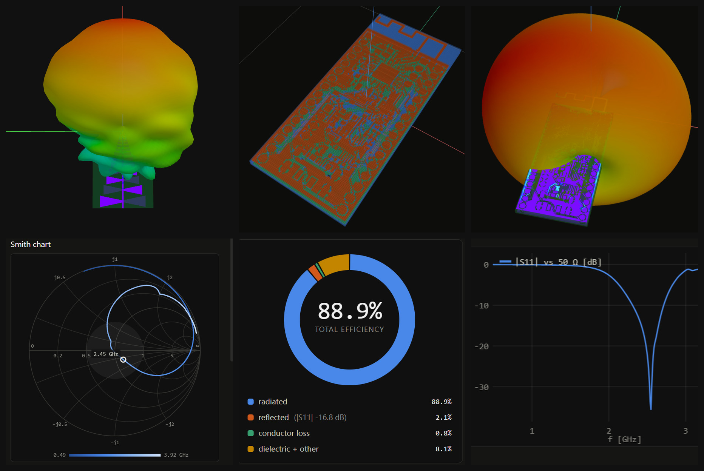
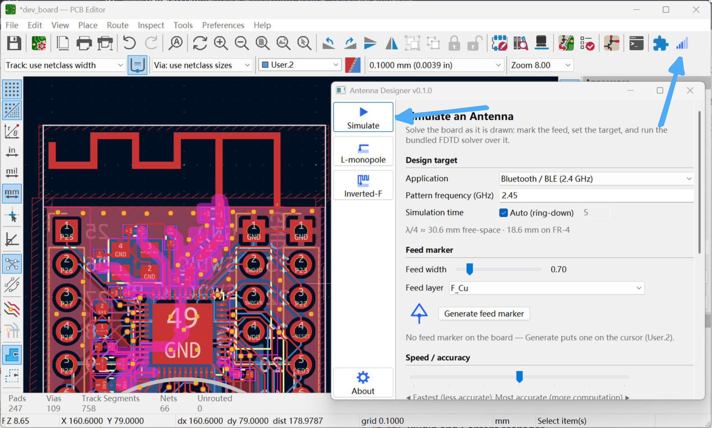
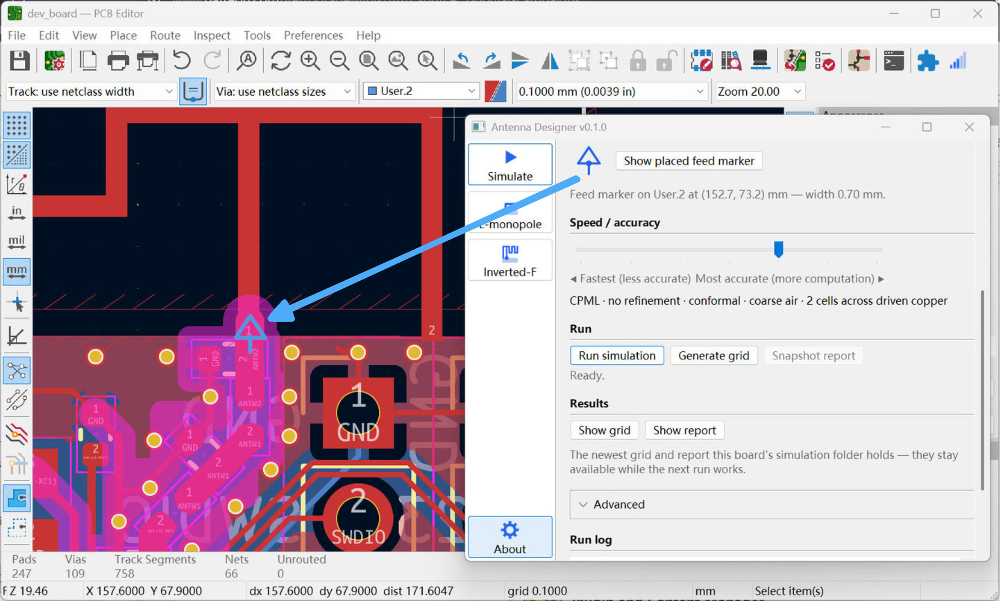
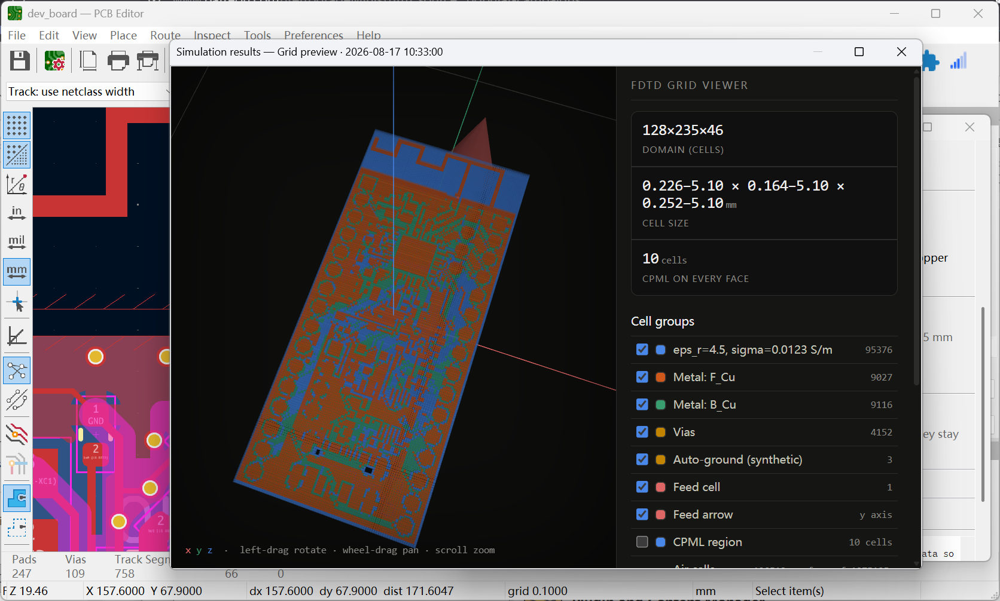
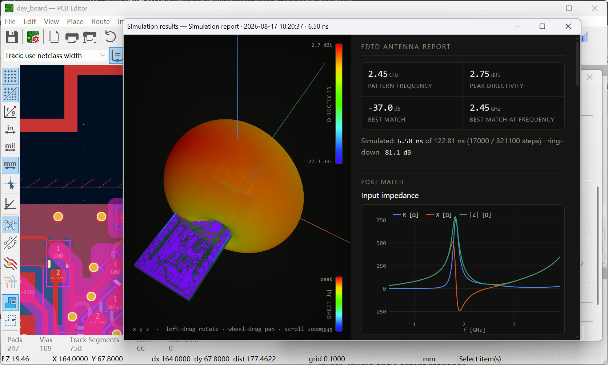

# Antenna Designer

A [KiCad](https://www.kicad.org/) **pcbnew** plugin for designing and
simulating PCB antennas without leaving the board editor.

It adds one button to the PCB toolbar. Behind it:

- **EM simulation** of the board you have open — a bundled FDTD solver meshes
  your real copper, stackup and drills and reports the antenna's radiation
  pattern and impedance (S11).
- **Design wizards** for common topologies — an **L-shaped monopole** and a
  **meandered inverted-F**. Mark the area the antenna may use, sweep its
  dimensions, and the plugin simulates the candidates and ranks them by S11 at
  your target frequency.

## Install

**Requirements:** KiCad 9.0 or later is recommended. Windows and Linux are both
supported — the one package below carries the simulator for each, and the
plugin runs whichever belongs to the machine it starts on. The Linux build
is x86-64. macOS is not supported yet: there is no macOS build of the
simulator, so a run there stops with a message saying so.

Download [`AntennaDesigner-<ver>-pcm.zip`](https://github.com/admin-2026/kicad_ems_plugin_pub/tree/main/dist) and let KiCad install it:

**Plugin and Content Manager > Install from File…** → pick the downloaded zip.

Then restart KiCad. An antenna button appears on the top toolbar.

The [releases
page](https://github.com/admin-2026/kicad_ems_plugin_pub/releases) keeps the
older versions.

### Manual install

The package is a plain zip and installing it is only a folder copy, so you can
do that part yourself — worth knowing if the manager refuses the file, or if
the KiCad you want it in isn't the one you are looking at:

1. Unzip `AntennaDesigner-<ver>-pcm.zip`. The plugin is the `plugins` folder
   inside it; the rest is what the manager reads.
2. In the PCB editor: **Tools > External Plugins > Open Plugin Directory**.
   KiCad opens its own plugin folder in your file manager — that is the
   destination, whatever the path turns out to be.
3. Copy that `plugins` folder into it and **rename it `antenna_plugin`**. The
   name becomes the plugin's module name, so anything valid works, but it has
   to be a name and not `plugins`. Copy it whole: the simulator binaries sit
   inside it. If an older copy is already there, delete that copy first rather
   than merging the two — modules dropped since would otherwise stay behind
   and still be imported.
4. **Tools > External Plugins > Refresh Plugins**, or restart KiCad.

Repeat per KiCad if you run more than one; each version has its own plugin
directory. On Linux, check that `antenna_plugin/binaries/monopole` is still
executable afterwards (`chmod +x`) — some archive managers drop the execute
bit on the way out of a zip, which KiCad's own installer does not. You can
delete the build you don't need (`monopole.exe` on Linux, `monopole` on
Windows); the plugin only ever reaches for its own.

## Getting started

Open a board and press the antenna button. The window has a sidebar; each entry is one way to work.

### Simulate the board you have

1. Set the **pattern frequency** you care about, and pick the metal and
   dielectric of each layer if the board's stackup doesn't already say.

   

2. Tell the plugin **where the antenna is fed**. Press **Generate feed marker**
   and click the feed trace — the marker is a line across the trace with a
   triangle pointing toward the antenna.

   

3. Press **Generate grid** for a quick look at the mesh your board produces —
   the viewer shows the cell counts and lets you switch the copper, vias and
   air groups on and off.

   

4. Press **Run simulation** for the full solve. The report opens with the
   radiation pattern, peak directivity and the port match.

   

A full solve can take anywhere from minutes to several hours. The log shows
progress as it goes, and you can **Stop** it early — you still get a report
from what was simulated so far — or take a **Snapshot report** without
stopping. **Show grid** and **Show report** reopen the newest of each without
re-running.

### Design an antenna from scratch

Pick a designer in the sidebar (**L-monopole** or **Inverted-F**):

1. Place the **area marker** — a rectangle showing where the antenna may live,
   with a triangle marking the feed edge. Drag, rotate and resize it like any
   other board object; the sliders reshape it live.
2. Choose which dimensions to sweep (the resonant length, track width, and the
   topology's own knobs). Moving a slider previews that candidate on the board.
3. Press **Start scan**. Each candidate is simulated on a copy of your board —
   the board itself is never modified — and the results table ranks them.
4. Press **Generate + place footprint** to put the winner on the board as a
   footprint, saved for reuse.

Scans are saved next to their results, so reopening the plugin days later
brings the table back without re-running the sweep.

### Where things are written

Everything — inputs, configs and results — goes in a `simulation/` folder
beside your board file, inside the KiCad project directory.

## If something goes wrong

- The plugin checks the board before every run and explains what is missing in
  a banner at the top of the window, each problem with its own help page.
- The **About** tab in the sidebar lists the versions of the plugin, the
  simulator, KiCad and Python. That is the list worth quoting in a bug report.
  It also links to the project's source repository and community chat, both
  below.

## Licence

Antenna Designer is two pieces of software under two licences, and the package
carries both files:

- **The plugin** — everything in this repository except the simulator binary —
  is **MIT** licensed ([`LICENSE`](LICENSE)). Use it, change it, ship it.
- **The simulator** (`binaries/monopole`, `monopole.exe`) is **proprietary and
  free for non-commercial use** ([`LICENSE-solver.txt`](LICENSE-solver.txt)).
  Personal projects, teaching and research are free, and that includes the
  simulation results — you may share the plugin and the solver with anyone, as
  long as you pass them on unchanged and don't charge for them.

Using it to design something you sell — a product, a client's board, paid
consulting — needs a commercial licence. Ask on
[Discord](https://discord.gg/XDY6EE5WA) or open an issue on
[GitHub](https://github.com/admin-2026/kicad_ems_plugin_pub); it's a short
conversation, not a sales funnel.

## Project links

- **Source code:** <https://github.com/admin-2026/kicad_ems_plugin_pub>
- **Examples:** <https://github.com/admin-2026/kicad_ems_plugin_examples> —
  boards to open and simulate.
- **Community chat (Discord):** <https://discord.gg/XDY6EE5WA>

## For developers

Building, packaging, the module layout and how to add an antenna topology are
in [docs/DEVELOPMENT.md](docs/DEVELOPMENT.md).
